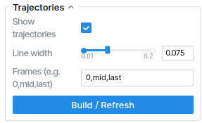

# Trace Anything: Representing Any Video in 4D via Trajectory Fields
<p align="center">
  <a href="https://trace-anything.github.io/">
    
  </a>
  <a href="https://arxiv.org/abs/2510.13802">
    
  </a>
  <a href="https://youtu.be/PFmwkomheSA?si=3WBNSGNIdqlCTl-1">
    
  </a>
  <a href="https://trace-anything.github.io/viser-client/interactive.html">
    
  </a>
  <a href="https://huggingface.co/depth-anything/trace-anything">
    
  </a>
</p>


<div align="center" class="is-size-5 publication-authors">
  <span class="author-block">
    <a href="https://xinhangliu.com/">Xinhang Liu</a><sup>1,2</sup>&nbsp;&nbsp;&nbsp;&nbsp;
  </span>
  <span class="author-block">
    <a href="https://henry123-boy.github.io/">Yuxi Xiao</a><sup>1,3</sup>&nbsp;&nbsp;&nbsp;&nbsp;
  </span>
  <span class="author-block">
    <a href="https://donydchen.github.io/">Donny Y. Chen</a><sup>1</sup>&nbsp;&nbsp;&nbsp;&nbsp;
  </span>
  <span class="author-block">
    <a href="https://scholar.google.com.sg/citations?user=Q8iay0gAAAAJ&hl=en">Jiashi Feng</a><sup>1</sup>&nbsp;&nbsp;&nbsp;&nbsp;
  </span>
  <br>
  <span class="author-block">
    <a href="https://yuwingtai.github.io/">Yu-Wing Tai</a><sup>4</sup>&nbsp;&nbsp;&nbsp;&nbsp;
  </span>
  <span class="author-block">
    <a href="https://cse.hkust.edu.hk/~cktang/bio.html">Chi-Keung Tang</a><sup>2</sup>&nbsp;&nbsp;&nbsp;&nbsp;
  </span>
  <span class="author-block">
    <a href="https://bingykang.github.io/">Bingyi Kang</a><sup>1</sup>&nbsp;&nbsp;&nbsp;&nbsp;
  </span>
</div>

<br>

<div align="center" class="is-size-5 publication-authors">
  <span class="author-block"><sup>1</sup>Bytedance Seed</span>&nbsp;&nbsp;&nbsp;&nbsp;
  <span class="author-block"><sup>2</sup>HKUST</span>&nbsp;&nbsp;&nbsp;&nbsp;
  <span class="author-block"><sup>3</sup>Zhejiang University</span>&nbsp;&nbsp;&nbsp;&nbsp;
  <span class="author-block"><sup>4</sup>Dartmouth College</span>
</div>


## Overview
We propose a 4D video representation, __trajectory field__, which maps each pixel across frames to a continuous, parametric 3D trajectory. With a single forward pass, the __Trace Anything__ model efficiently estimates such trajectory fields for any video, image pair, or unstructured image set.
This repository provides the official PyTorch implementation for running inference with the Trace Anything model and exploring trajectory fields in an interactive 3D viewer.

  


##  Setup

### Create and activate environment

```bash
# Clone the repository
git clone https://github.com/ByteDance-Seed/TraceAnything.git
cd TraceAnything

# Create and activate environment
conda create -n trace_anything python=3.10
conda activate trace_anything
```

### Requirements

* **Python** ≥ 3.10
* **PyTorch** (install according to your CUDA/CPU setup)
* **Dependencies**:

  ```bash
  pip install einops omegaconf pillow opencv-python viser imageio matplotlib torchvision
  ```

**Notes**

- **CUDA:** Tested with **CUDA 12.8**.  
- **GPU Memory:** The provided examples are tested to run on a **single GPU with ≥ 48 GB VRAM**.


### Model weights

Download the pretrained **[model](https://huggingface.co/depth-anything/trace-anything/resolve/main/trace_anything.pt?download=true)** and place it at:

```text
checkpoints/trace_anything.pt
```


##  Inference

We provide example input videos and image pairs under `examples/input`.
Each subdirectory corresponds to a scene:

```
examples/
  input/
    scene_name_1/
      ...
    scene_name_2/
      ...
```

The inference script loads images from these scene folders and produces outputs.

---

### Notes

* Images must satisfy `W ≥ H`. (Portrait images are automatically transposed.)
* Images are resized so that the long side = **512**, then cropped to the nearest multiple of 16 (a model requirement).
* If the number of views exceeds 40, the script automatically downsamples.
* (Advanced) The script assumes input images are ordered in time (e.g., video frames or paired images). Support for unstructured, unordered inputs will be released in the future.

---

### Running inference

Run the model over all scenes:

```bash
python scripts/infer.py
```

#### Default arguments

You can override these paths with flags:

* `--config     configs/eval.yaml`
* `--ckpt       checkpoints/trace_anything.pt`
* `--input_dir  examples/input`
* `--output_dir examples/output`

#### Example

```bash
python scripts/infer.py \
  --input_dir examples/input \
  --output_dir examples/output \
  --ckpt checkpoints/trace_anything.pt
```

Results are saved to:

```text
<output_dir>/<scene>/output.pt
```

---

### What’s inside `output.pt`?

* `preds[i]['ctrl_pts3d']` — 3D control points, shape `[K, H, W, 3]`
* `preds[i]['ctrl_conf']` — confidence maps, shape `[K, H, W]`
* `preds[i]['fg_mask']` — binary mask `[H, W]`, computed via Otsu thresholding on control-point variance.
  (Mask images are also saved under `<output_dir>/<scene>/masks`.)
* `preds[i]['time']` — predicted scalar time ∈ `[0, 1)`.

  > Even though the true timestamp is implicit from known sequence order, the network’s timestamp head still estimates it.
* `views[i]['img']` — normalized input image tensor ∈ `[-1, 1]`


## Optional: User-Guided Masks with SAM2

If you prefer **user-guided SAM2 masks** instead of the automatic masks computed from Trace Anything outputs (for visualization), we provide a helper script [`scripts/user_mask.py`](scripts/user_mask.py). This script lets you interactively select points on the first frame of a scene to produce per-frame foreground masks. 

Install [SAM2](https://github.com/facebookresearch/sam2) and download its checkpoint. Then run with:

```bash
python scripts/user_mask.py --scene <output_scene_dir> \
  --sam2_cfg configs/sam2.1/sam2.1_hiera_l.yaml \
  --sam2_ckpt <path_to_sam2_ckpt>
```

This will saves masks to:

  ```
  <scene>/masks/{i:03d}_user.png
  ```
It also updates `<scene>/output.pt` with:

  ```python
  preds[i]["fg_mask_user"]
  ```

When visualizing, `fg_mask_user` will automatically be preferred over `fg_mask` if available.


##  Interactive Visualization 🚀
Our visualizer lets you explore the trajectory field interactively:


Fire up the interactive 3D viewer and dive your trajectory fields:

```bash
python scripts/view.py --output examples/output/<scene>/output.pt
```

### Useful flags

* `--port 8020` — set viewer port
* `--t_step 0.025` — timeline step (smaller = more fine-grained curve evaluation)
* `--ds 2` — downsample all data by `::2` for extra speed


### Remote use (SSH port-forwarding)

  ```bash
  ssh -N -L 8020:localhost:8020 <user>@<server>
  # Then open http://localhost:8020 locally
  ```

### Trajectory panel
  Input a frame number, or simply type `"mid"` / `"last"`.
  Then hit **Build / Refresh** to construct trajectories, and toggle **Show trajectories** to view them.

  

### Play around! 🎉

  * Pump up or shrink point size
  * Filter out noisy background / foreground points by confidence
  * Drag to swivel the viewpoint
  * Slide through time and watch the trajectories evolve

## Acknowledgements
We sincerely thank the authors of the open-source repositories [DUSt3R](https://github.com/naver/dust3r), [Fast3R](https://github.com/facebookresearch/fast3r), [VGGT](https://github.com/facebookresearch/vggt), [MonST3R](https://github.com/Junyi42/monst3r), [Easi3R](https://github.com/Inception3D/Easi3R), [St4RTrack](https://github.com/HavenFeng/St4RTrack?tab=readme-ov-file), [POMATO](https://github.com/wyddmw/POMATO?tab=readme-ov-file), [SpaTrackerV2](https://github.com/henry123-boy/SpaTrackerV2) and [Viser](https://github.com/nerfstudio-project/viser) for their inspiring and high-quality work that greatly contributed to this project.


## License

- **Code**: Licensed under the [Apache 2.0 License](http://www.apache.org/licenses/LICENSE-2.0).  
- **Model weights**: Licensed under the [CC BY-NC 4.0 License](https://creativecommons.org/licenses/by-nc/4.0/). These weights are provided for research and non-commercial use only.

## Citation

If you find our repository useful, please consider giving it a star ⭐ and citing our paper in your work:

```bibtex
@misc{liu2025traceanythingrepresentingvideo,
      title={Trace Anything: Representing Any Video in 4D via Trajectory Fields}, 
      author={Xinhang Liu and Yuxi Xiao and Donny Y. Chen and Jiashi Feng and Yu-Wing Tai and Chi-Keung Tang and Bingyi Kang},
      year={2025},
      eprint={2510.13802},
      archivePrefix={arXiv},
      primaryClass={cs.CV},
      url={https://arxiv.org/abs/2510.13802}, 
}
```